# 			JOS实验lab1

> **组员：1711347 李瑞峰    1711351 李汶蔚   1711308常欢**

> 完成情况：
>
> 每个人都完成了本次实验内容，并分工完成了相关部分的文档整理。课后抽时间相互交流讨论

## 一、实验简介

​	本次作业包含12个练习，学习掌握PC的启动过程，包含BIOS、引导bootloader程序、加载内核、弄清console.c、printf.c和printfmt.c的关系、学习堆栈原理等内容。

## 二、实验过程

### Exercise 1：熟悉 AT&T 汇编语言。

​        汇编语言的学习在大一下小学期的时候上过课程，对于AT&T 的语法有一定了解，此外，编译原理第二次作业有一部分是写一个汇编的阶乘程序，对于汇编的基本语法和知识有一定掌握。AT&T格式与intel格式的汇编主要有以下方面的不同：

```asm
寄存器命名原则 ：   AT&T: %eax                        Intel: eax
源/目的操作数顺序 ：AT&T: movl %eax, %ebx             Intel: mov ebx, eax  //AT&T 语法先写源操作数，再写目标操作数；Intel 语法先写目标操作数，再写源操作数： 
常数/立即数的格式： AT&T: movl $value, %ebx          Intel: mov eax, value
操作数长度标识 ：		AT&T: movw %ax, %bx               Intel: mov bx, ax
寻址方式：					AT&T:   immed32(basepointer, indexpointer, indexscale)
        				 Intel:  [basepointer + indexpointer × indexscale + imm32)
```

 参考书籍：Windows环境下32位汇编语言程序设计（典藏版）、x86汇编语言简明教程

### Exercise 2：学习使用GDB调试工具

| 指令                  | 解释                 |
| --------------------- | -------------------- |
| d      x              | 删除编号指定的断点   |
| c                     | 执行到下一个断点     |
| info registers        | 打印寄存器信息       |
| x/  <n/f/u>  `<addr>` | 查看指定内存地址内容 |
| b      addr           | 在addr处设置断点     |
| q                     | 退出                 |

### Exercise 3：跟踪bootloader程序

**（1）BIOS**

- 刚开始CPU上电时，从物理内存读取BIOS进内存，然后执行。

- 设置 IDT(interrupt descriptor table)并初始化各种设备比如VGA 显示设备等。 

- 在初始化完 PCI 总线和所有重要的设备之后,BIOS 将会搜寻一个可启动设备。

  从硬盘第一个扇区读取Bootloader执行程序，将控制权移交。

（**2）bootloader**

- boot.S 主要是将处理器从实模式转换到 32 位的保护模式，这是因为只有在保
  护模式中我们才能访问到物理内存高于 1MB 的空间。
- main.c 的主要作用是将内核的可执行代码从硬盘镜像中读入到内存中，具体的方式是运用 x86 专门的 I/O 指令。

**（3）gdb追踪**

```asm
 初始：
 0xfe05b:	cmpl   $0x0,%cs:0x65b4
 0xfe062:	jne    0xfd3aa
 0xfe066:	xor    %ax,%ax
 0xfe068:	mov    %ax,%ss
 0xfe06a:	mov    $0x7000,%esp
 0xfe070:	mov    $0xf431f,%edx
 0xfe076:	jmp    0xfd233
 0xfd233:	mov    %eax,%ecx
 0xfd236:	cli      
 0xfd237:	cld   
 0xfd238:	mov    $0x8f,%eax
 0xfd23e:	out    %al,$0x70
 0xfd240:	in     $0x71,%al
 0xfd242:	in     $0x92,%al
 0xfd244:	or     $0x2,%al
 0xfd246:	out    %al,$0x92
....

在0x7c00处设置断点：
[   0:7c00] => 0x7c00:	cli 
[   0:7c01] => 0x7c01:	cld  
[   0:7c02] => 0x7c02:	xor    %ax,%ax
[   0:7c04] => 0x7c04:	mov    %ax,%ds
[   0:7c06] => 0x7c06:	mov    %ax,%es
```

**在0x00007d0a处设置断点进入bootmain()函数：**

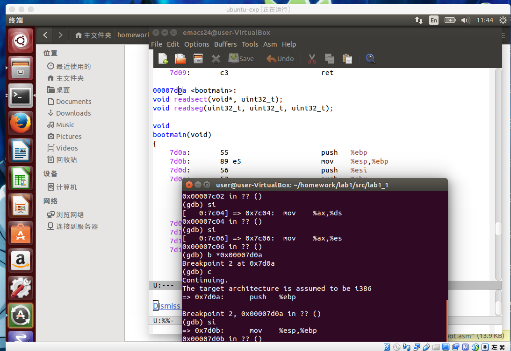

- bootmain在0x7d1b处第一次调用readseg：0x7d1b  call   7cd1` <readseg>`
- 执行到0x7cf9时调用了readsect:  0x7cf9:	call   0x7c7c

* 0x7d61:	call   *0x10018    

* 0x10000c:	movw   $0x1234,0x472  (执行kernel代码)

  **练习解答：**

  1. At what point does the processor start executing 32-bit code? What exactly causes the switch from 16- to 32-bit mode?

     > In boot.S 启动CUP并转换成32位保护模式

     ```x86
       # Switch from real to protected mode, using a bootstrap GDT
       # and segment translation that makes virtual addresses 
       # identical to their physical addresses, so that the 
       # effective memory map does not change during the switch.
       
       #这段在设置cr0
       #CR0寄存器的bit0是保护模式启动位，把这一位值1代表保护模式启动。
       lgdt    gdtdesc
       movl    %cr0, %eax
       orl     $CR0_PE_ON, %eax
       movl    %eax, %cr0
       
       # Jump to next instruction, but in 32-bit code segment.
       # Switches processor into 32-bit mode.
       ljmp    $PROT_MODE_CSEG, $protcseg
     ```

     指令 `lgdt gdtdesc`，是把gdtdesc这个标识符的值送入全局映射描述符表寄存器GDTR中。这个GDT表是处理器工作于保护模式下一个非常重要的表。这条指令的功能就是把关于GDT表的一些重要信息存放到CPU的GDTR寄存器中，其中包括GDT表的内存起始地址，以及GDT表的长度。

     当加载完GDT表的信息到GDTR寄存器之后， 这几步操作是在修改CR0寄存器的内容。CR0寄存器还有CR1~CR3寄存器都是80x86的控制寄存器。其中$CR0_PE的值定义于"mmu.h"文件中，为0x00000001。可见上面的操作是把CR0寄存器的bit0置1，CR0寄存器的bit0是保护模式启动位，把这一位值1代表保护模式启动。

  2. What is the last instruction of the boot loader executed, and what is the first instruction of the kernel it just loaded?

     > in main.c 
     >
     > 一个简单的启动加载程序，其唯一的工作就是从第一个IDE硬盘启动ELF内核映像。

     ```
     ((void (*)(void)) (ELFHDR->e_entry))();
     ```

     > In boot.asm,

     ```
     0x7d6b:  	call   *0x10018
     ```

     在gdb中继续调用si

     ```
     0x10000c:  movw   $0x1234,0x472
     ```

  3. Where is the first instruction of the kernel?

     > 因为boot loader最后执的是call *0x10018，看一下0x10018存的地址是什么

     ```
     (gdb) x/1x 0x10018 #以16进制输出一位 0x10018是内存，0x001000c
     0x10018：	0x0010000c
     ```

  4. How does the boot loader decide how many sectors it must read in order to fetch the entire kernel from disk? Where does it find this information?

     ```c
     // load each program segment (ignores ph flags)
     	ph = (struct Proghdr *) ((uint8_t *) ELFHDR + ELFHDR->e_phoff);
     	eph = ph + ELFHDR->e_phnum;
     	for (; ph < eph; ph++)
     		// p_pa is the load address of this segment (as well
     		// as the physical address)
     		readseg(ph->p_pa, ph->p_memsz, ph->p_offset);
     //从 ELF 头知道的，由 e_phoff 知道第一个段的位置， 由 e_phnum 可以知道需要加载几个段。
  //第 i 段程序头表表项位置 = 文件起始位置 + 程序头表偏移e_phoff + i * 程序头表项字节数 
     //第 i 段地址就是第i个程序头表表项的 p_offset 值。
     ```
     
     
     
     ```
     // ELF 文件头
     struct Elf {
         uint32_t e_magic; // 标识是否是ELF文件
         uint8_t e_elf[12]; // 魔数和相关信息 
         uint16_t e_type; // 文件类型
         uint16_t e_machine; 
         uint16_t e_version; // 版本信息
         uint32_t e_entry; // 程序入口点
         uint32_t e_phoff; // 程序头表偏移值
         uint32_t e_shoff; // 节头表偏移值
         uint32_t e_flags; 
         uint16_t e_ehsize;  // 文件头长度
         uint16_t e_phentsize; // 程序头部长度 
         uint16_t e_phnum; // 程序头部个数 
         uint16_t e_shentsize; // 节头部长度 
         uint16_t e_shnum; // 节头部个数 
         uint16_t e_shstrndx; // 节头部字符索引
     };
     ```
     

### Exercise 4：了解C中的指针

* 如果int * p =（int *）100，则（int）p + 1和（int）（p + 1）是不同的数字：第一个是101，但第二个是104.当向指针添加一个整数时， 在第二种情况下，整数默认会乘以指针指向的对象的大小。

*  p [i]被定义为与*（p + i）相同，指的是p指向的存储器中的第i个对象。上述的规则在对象大于一个字节时是非常需要注意的。

* ＆p [i]与（p + i）相同，是p指向的存储器中的第i个对象的地址。

### Exercise 5：链接地址&加载地址的关系

**链接地址：程序自己假设在内存中的存放的位置,即编译器编译时认定程序将会存放在以链接地址开始的连续内存空间。载入地址：程序真正存放的地址。两者一般情况是一样的。**

修改 `boot/Makefrag` 中的链接地址 0x7C00 为一个错误地址 0x7C10，make clean，重新执行启动qemu。在执行完 `ljmp $0x8, $0x7c42`这句指令后报错如下：

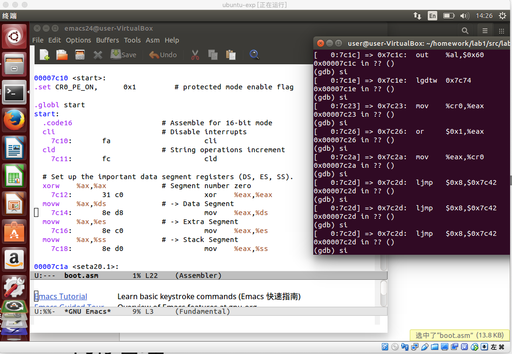

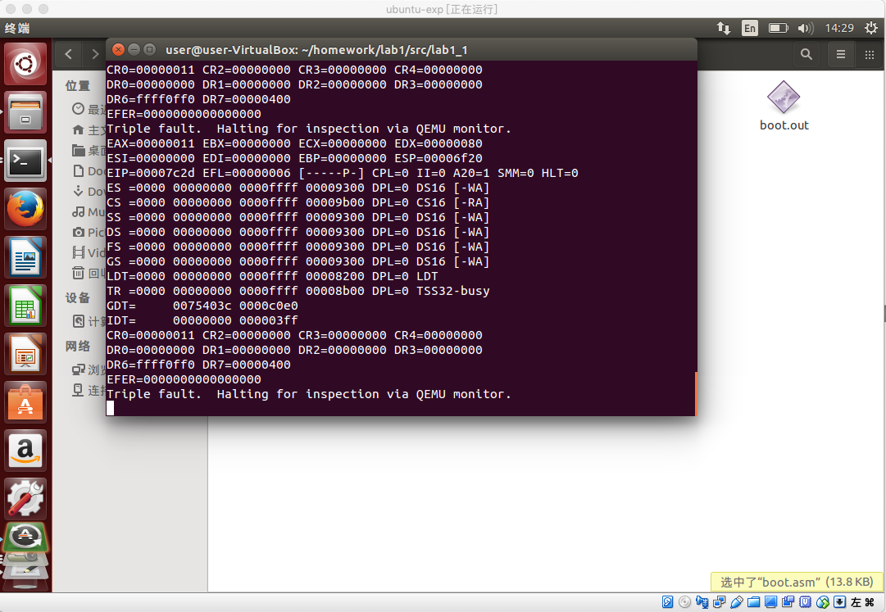

### Exercise 6：检查内核加载前后内存中0x00100000地址开始的8个字的内容

* 在0x7c00处设置断点，此时开始执行boot程序，还没有加载内核，此时查看0x00100000地址开始的8个字的内容全为空。

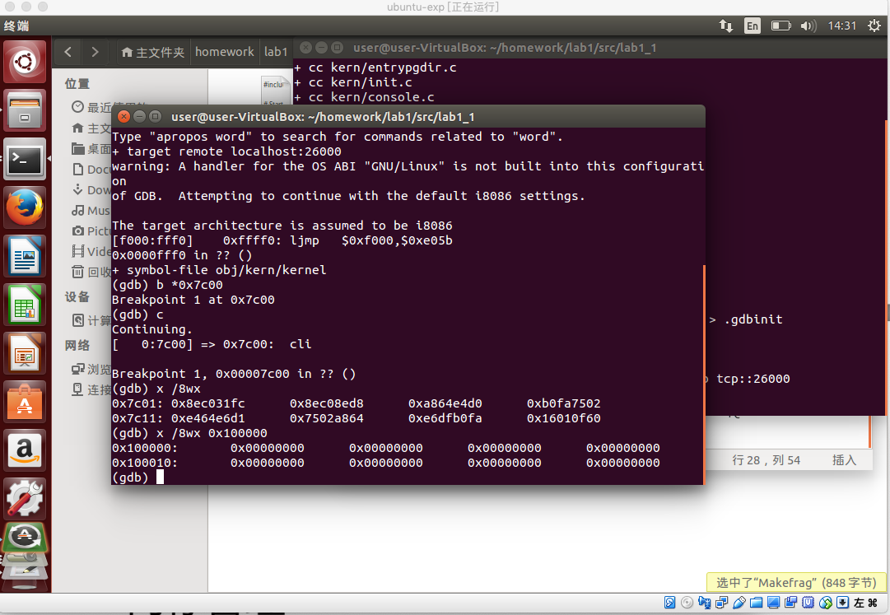

* 在0x10000c处设置断点，此时执行到kernel的入口处，kernel已经加载至内存，再次查看内容如下：

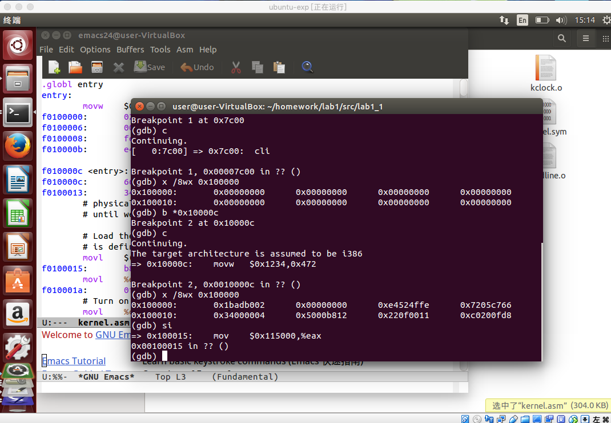

### Exercise 7：测试分页效果

* 在0x100025处设置断点，调至此处，此时即将开启分页，查看高地址KERNBASE `0xf0100000`开始的内容和低地址0x100000开始的内容，两者内容不同，虚拟地址的内容为0。

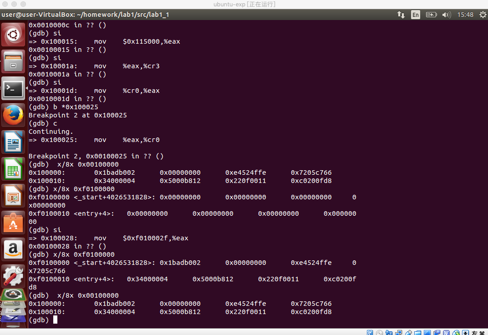

* 开启分页后，虚拟地址 [KERNBASE, KERNBASE+4M) 映射到了物理内存的 [0, 4M)，再次查看内容，发现 0xf0100000 与 0x00100000 的内容是一样的。

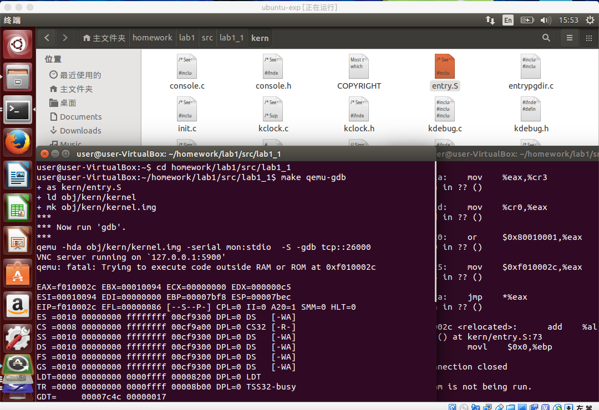

### Exercise 8：**格式化打印到控制台**

1. 阅读 kern/printf.c、lib/printfmt.c 和 kern/console.c,弄明白它们之间的关系。

   `console.c` 导出了 cputchar，getchar等函数。

   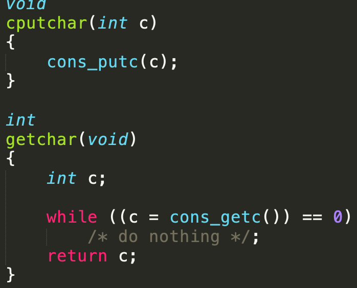

   `printf.c` 的 vprintfmt 函数中使用了 putch函数作为参数，而putch函数调用了console.c中的cputchar。

   简单来说，printf.c的功能，就是基于printfmt()和内核控制台的cputchar()的内核的cprintf控制台输出的简单实现。

   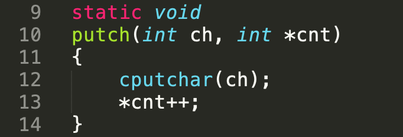

   `Printfmt.c`是精简的原始printf样式格式化例程，printf中的函数vcprintf调用了vprintfmt。

2. 我们省略了一小段代码 - 使用“％o”形式的模式打印八进制数字所需的代码。查找并补全此代码片段。

   找到位置

   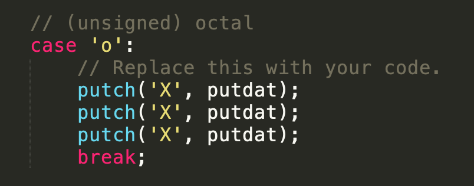

   这个位置比较好办，上下分别是10进制和16进制的情况作为例子

   ```c
   case 'o':
   			// Replace this with your code.
   			num = getuint(&ap, lflag);
   			putch('0',putdat) //在当前光标处向屏幕输出字符ch，然后光标自动右移一个字符位置。就是上上个图片的putch，三者的关系也就很明了了
   			base = 8;
   			goto number;
   ```

   还有一个小问题就是lflag，文档里写的很好：lfag 变量则是专门在输出数字的时候起作用，在我们这个实验中为了简单起见实际上是不支持输出浮点数的，于是 vprintfmt 函数只能够支持输出整形数，，输出整形数时，当 lflag=0 时，表示将参数当做 int 型的来输出，当 lflag=1 时，表示当做 long 型的来输出，而当 lflag=2 时表示当做 long long 型的来输出。

   所以之前有这些代码

   ```c
   lflag=0;
   ......
   // long flag (doubled for long long)
   		case 'l':
   			lflag++;
   			goto reswitch;
   ​```questions&answers：**
   ```

**问题解答**

**1.解释printf.c和console.c之间的接口。具体来说，console.c导出了什么函数？ printf.c如何使用这些函数？**

​	答：printf.c中的cprintf函数调用vcprintf，vcprintf调用lib/printfmt.c中的vprintfmt，vprintfmt调用printf.c中的putch函数，putch函数调用console.c中的cputchar函数，最终cputchar函数实现字符打印。

​	Printf.c代码很短，基本上就是各种函数的调用，就像是一些函数的连接枢纽文件。

​	Console.c中有大量的宏定义，除了宏定义之外的内容可以明显的看到键盘上的键名以及鼠标滚轮滚动等指令的定义。因此大致推测console.c的作用是和底层的硬件打交道，识别硬件输入设备的指令，将硬件传输的电信号转化成数字信号（以地址的形式）参与编译。截图中可以看到cputchar函数的定义在console.c中，而printf.c中调用过cputchar函数，这个函数的作用应该是将硬件输入结果最终显示在屏幕上，而printf.c中的调用显示了两者存在联系，但是并不是直接调用，中间还借助了printfmt.c的帮助。

​	Printfmt.c代码也很长，主要就是vprintfmt函数。Printfmt.c可以理解为console.c和printf.c之间的翻译官角色，console.c输出的是由硬件电信号转化来的地址形式的数字信号，但是并不是可以直接被函数调用和输出的形式，printfmt中大量的case就是重新定义了这些地址形式的数字信号在编译处理时函数调用中的意义。换言之，printfmt是将console.c输出的地址信号进行了错误检查、格式处理之类的操作后，翻译为printf.c可以理解的代码意义上的数据类型，从而在console.c和printf.c之间建立起了联系。

**2.从console.c解释以下内容：**

```c++
1      if (crt_pos >= CRT_SIZE) {

2              int i;

3              memmove(crt_buf, crt_buf + CRT_COLS, (CRT_SIZE - CRT_COLS) * sizeof(uint16_t));

4                      for (i = CRT_SIZE - CRT_COLS; i < CRT_SIZE; i++)

5                     crt_buf[i] = 0x0700 | ' ';

6             crt_pos -= CRT_COLS;

7     } 
```

- crt_pos：缓冲区显示内容的最后一个字符的指针。
- if语句保证缓冲区中的最后显示出去的内容的大小不要超过显示的大小界限CRT_SIZE
- memmove：原型：void *memmove( void* dest, const void* src, size_t count );

**由src所指内存区域复制count个字节到dest所指内存区域。**

**这段代码的作用是检测当前屏幕的输出缓冲是否满了，然后屏幕滚动一行。这里的memcpy其实就是把第二个参数指向的地址内容移动n字节到第一个参数指向的地址。n由第三个参数指定。如果缓冲满了，把屏幕第一行覆盖掉逐行上移，空出最后一行，并由for循环填充以空格，最后把crt_pos置于最后一行的行首。**

**3.**fmt指向的是参数中的格式字符串，而ap指向fmt的后一个参数地址

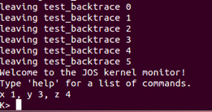

**4.**下面代码输出是 `He110 World`。 

**由于x86是小端模式，代表字的最高位字节存放在最高位字节地址上。假设i变量的地址为0x00，那么i的4个字节的值存放在0x00，0x01，0x02，0x03四处。由于是小端存储，所以0x00处存放0x72('r')，0x01处存放0x6c('l')，0x02处存放0x64('d')，0x03处存放0x00('\0').**

**所以在cprintf将会从i的地址开始一个字节一个字节遍历，正好输出 "World"**

**如果是大端并不影响he11o的输出，因为57616的16进制是e110，并不依赖于大小端存储的差异，但是大端中代表字的最高位字节存放在最低位字节地址上，因此i作为world的参数，需要修改与小端存放的结果相反，Ox00处存放0x00（＇ｒ＇），0x01处存放0x64('l')，0x02处存放0x6c('d')，0x03处存放0x72('\0').**

```c++
unsigned int i = 0x00646c72;

cprintf("H%x Wo%s", 57616, &i);
```

* 在下面的代码中，将在“y =”之后打印什么？ （注意：答案不是一个固定的值。）为什么会发生这种情况？**

**cprintf("x=%d y=%d", 3);**

**输出的结果如下**

　                                                  

　**由于y并没有参数被指定，所以会输出一个不确定的值。**

* 假设GCC更改了它的调用约定，以声明的顺序将参数压入栈中，这样会使最后一个参数最后被压入。 你将如何更改cprintf或其接口，以便仍然可以传递一个可变数量的参数？

**可以修改cprintf中参数的顺序，将原本排在前面的参数后声明以维持参数压入栈中后的顺序不变。**

### Exercise 9：内核如何为栈保留空间

1. 在跳转到entry之前，并没有对%esp，%ebp寄存器的内容进行修改，可见在bootmain中并没有初始化堆栈空间的语句。

   下面进入entry.S，看到了如下句子，说明栈再次初始化

   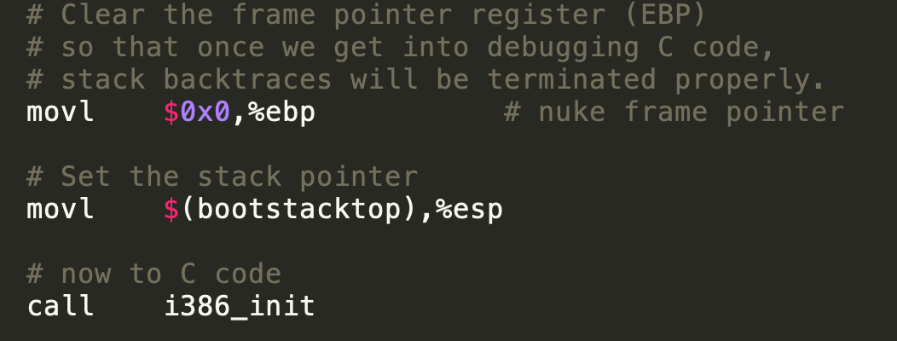

2. 在kernel/entry.s中分配了栈的大小

   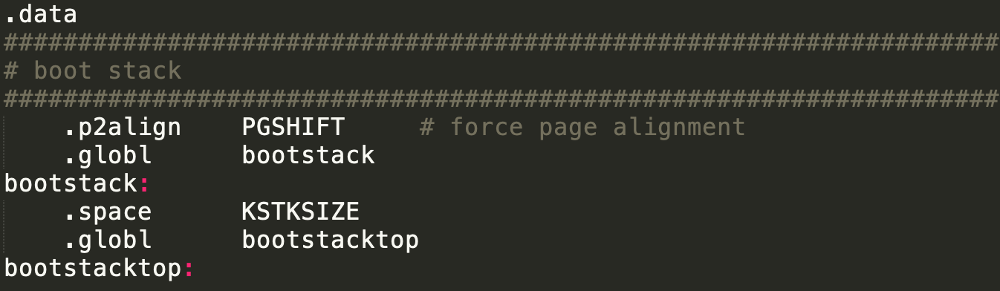

   KSTKSIZE = 8 * PGSIZE(页大小) = 8 * 4096 ，定义为32K

3. 从 obj/kernel/kernel.asm中可以看到栈顶是0xf0110000，栈是由高地址往地地址扩展的，所以初始指针必然指向栈顶

   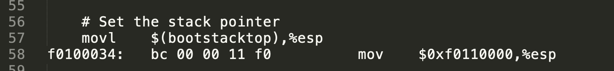

4. 已经知道了栈的空间大小以及栈顶的虚拟地址，栈大小为32KB=32768Byte。所以用于堆栈的地址空间为 0xf0110000=1114112，1114112-32768=0xf108000。那么这个堆栈实际坐落在内存的 0x00108000-0x00110000物理地址空间中。

### Exercise 10：test_backtrace的递归调用时，会在栈上压入多少个32位的字

%esp存储栈顶的位置，%ebp存储调用者栈顶的位置，%eax存储x的值

所以我们设置断点后，对每一次断点看一下，命令行节选如下

```
Breakpoint 2, test_backtrace (x=5) at kern/init.c:13
13	{
(gdb) si
=> 0xf0100041 <test_backtrace+1>:	mov    %esp,%ebp
0xf0100041	13	{
(gdb) ir
Undefined command: "ir".  Try "help".
(gdb) i r
eax            0x0	0
ecx            0x3d4	980
edx            0x3d5	981
ebx            0x10094	65684
esp            0xf010ffd8	0xf010ffd8
ebp            0xf010fff8	0xf010fff8
esi            0x10094	65684
edi            0x0	0
eip            0xf0100041	0xf0100041 <test_backtrace+1>
eflags         0x82	[ SF ]
cs             0x8	8
ss             0x10	16
ds             0x10	16
es             0x10	16
fs             0x10	16
gs             0x10	16
(gdb) c
Continuing.
=> 0xf0100040 <test_backtrace>:	push   %ebp

Breakpoint 2, test_backtrace (x=4) at kern/init.c:13
13	{
(gdb) si
=> 0xf0100041 <test_backtrace+1>:	mov    %esp,%ebp
0xf0100041	13	{
(gdb) si
=> 0xf0100043 <test_backtrace+3>:	push   %ebx
0xf0100043	13	{
(gdb) ir
Undefined command: "ir".  Try "help".
(gdb) i r
eax            0x4	4
ecx            0x3d4	980
edx            0x3d5	981
ebx            0x5	5
esp            0xf010ffb8	0xf010ffb8
ebp            0xf010ffb8	0xf010ffb8
esi            0x10094	65684
edi            0x0	0
eip            0xf0100043	0xf0100043 <test_backtrace+3>
eflags         0x6	[ PF ]
cs             0x8	8
ss             0x10	16
ds             0x10	16
es             0x10	16
fs             0x10	16
gs             0x10	16
(gdb) print $ebp
$1 = (void *) 0xf010ffb8
(gdb) print $esp
$2 = (void *) 0xf010ffb8
(gdb) c
Continuing.
=> 0xf0100040 <test_backtrace>:	push   %ebp

Breakpoint 2, test_backtrace (x=3) at kern/init.c:13
13	{
(gdb) c
Continuing.
=> 0xf0100040 <test_backtrace>:	push   %ebp

Breakpoint 2, test_backtrace (x=2) at kern/init.c:13
13	{
(gdb) i r
eax            0x2	2
ecx            0x3d4	980
edx            0x3d5	981
ebx            0x3	3
esp            0xf010ff7c	0xf010ff7c
ebp            0xf010ff98	0xf010ff98
esi            0x10094	65684
edi            0x0	0
eip            0xf0100040	0xf0100040 <test_backtrace>
eflags         0x6	[ PF ]
cs             0x8	8
ss             0x10	16
ds             0x10	16
es             0x10	16
fs             0x10	16
gs             0x10	16
(gdb) c
Continuing.
=> 0xf0100040 <test_backtrace>:	push   %ebp

Breakpoint 2, test_backtrace (x=1) at kern/init.c:13
13	{
(gdb) i r
eax            0x1	1
ecx            0x3d4	980
edx            0x3d5	981
ebx            0x2	2
esp            0xf010ff5c	0xf010ff5c
ebp            0xf010ff78	0xf010ff78
esi            0x10094	65684
edi            0x0	0
eip            0xf0100040	0xf0100040 <test_backtrace>
eflags         0x2	[ ]
cs             0x8	8
ss             0x10	16
ds             0x10	16
es             0x10	16
fs             0x10	16
gs             0x10	16
```

用`Breakpoint 2, test_backtrace (x=1) at kern/init.c:13`和`Breakpoint 2, test_backtrace (x=2) at kern/init.c:13`为例，esp相差16Byte，32位的字也就是4个byte，所以一次压入4个字节。

运行截图如下：

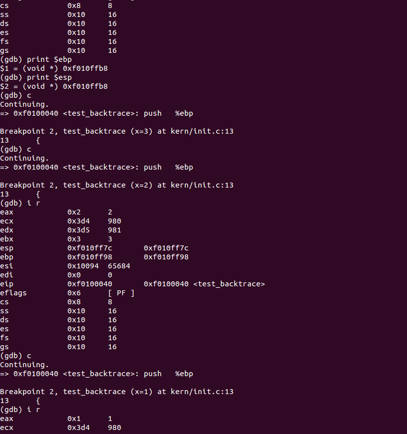

### Exercise 11-12：完成 mon_backtrace 函数，掌握函数调用时堆栈的原理

*  `kdebug.c`:中添加以下代码

```
 stab_binsearch(stabs, &lline, &rline, N_SLINE, addr);
	info->eip_line = stabs[lline].n_desc;
```

stabs指的是调试符号表,可以通过gcc编译时加上`-gstabs -S`来生成source.s文件. 它的一般格式是`.stabs "string",type,other,desc,value`

其自定义的`stab`结构为:

```c++
/* Entries in the STABS table are formatted as follows. */
struct stab {
    uint32_t n_strx;        // index into string table of name
    uint8_t n_type;         // type of symbol
    uint8_t n_other;        // misc info (usually empty)
    uint16_t n_desc;        // description field
    uintptr_t n_value;      // value of symbol
};
```

参见 `inc/stab.h` 可以看到stabs结构的定义和常见的stabs类型：

```c++
struct Stab {
	uint32_t n_strx;	// index into string table of name
	uint8_t n_type;         // type of symbol
	uint8_t n_other;        // misc info (usually empty)
	uint16_t n_desc;        // description field
	uintptr_t n_value;	// value of symbol
};

#define	N_FUN		0x24	// procedure name
#define	N_SLINE		0x44	// text segment line number
#define	N_SO		0x64	// main source file name
#define	N_SOL		0x84	// included source file name
```

* `monitor.c`修改如下:

```c++
mon_backtrace(int argc, char **argv, struct Trapframe *tf)
{
	// Your code here.
	while (ebp) 
	{

		uint32_t* ebp = (uint32_t*) read_ebp();
		cprintf("Stack backtrace:\n");

		    cprintf("ebp %x  eip %x  args", ebp, *(ebp+1));

			//打印 mon_backtrace() 中对应每个 eip 的函数名、文件名和行号
		    cprintf(" %x", *(ebp+2));
		    cprintf(" %x", *(ebp+3));
		    cprintf(" %x", *(ebp+4));
		    cprintf(" %x", *(ebp+5));
		    cprintf(" %x\n", *(ebp+6));
		    ebp = (uint32_t*) *ebp;

		    eip = *(ebp+1);
		    struct Eipdebuginfo debug_info;
			debuginfo_eip(eip, &debug_info);
		    cprintf("\t%s:%d: %.*s+%d\n",
			debug_info.eip_file, debug_info.eip_line, debug_info.eip_fn_namelen,
			debug_info.eip_fn_name, eip - debug_info.eip_fn_addr);
	}
	return 0;
}
```

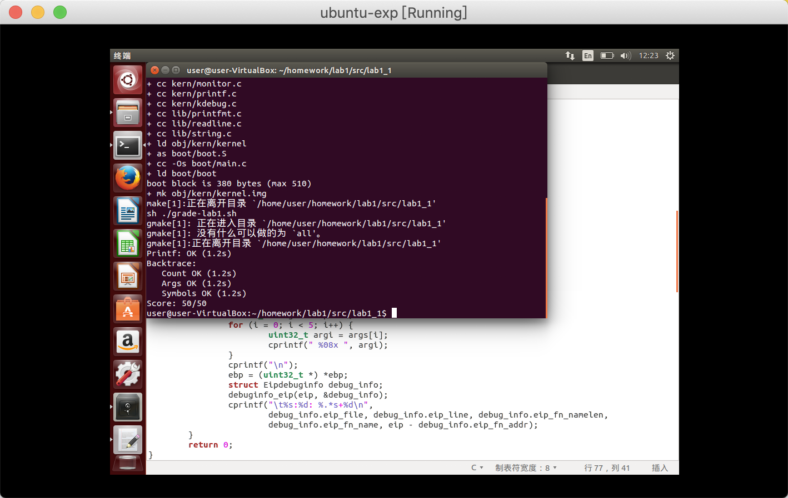

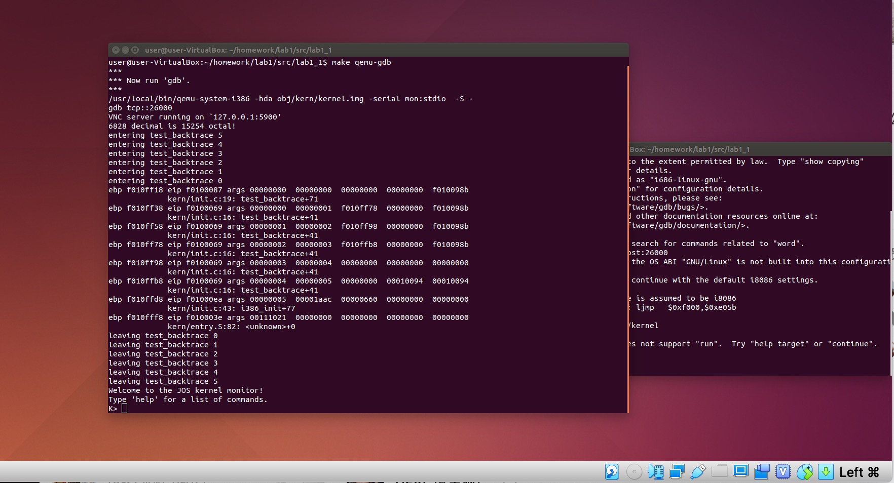


## 三、问题&讨论

### 问题一：实模式和保护模式

1. 实模式下为什么需要段加偏移量来操作内存，这样的话岂不是会有多种段偏移量写法对应一个内存地址？这是早期硬件限制的一个伤痕，那时候地址总线只有20bit但20bit的地址不能放在16比特的寄存器中，只好用两个16bit的寄存器，其中一个寄存器的4bit有效（然而为了简便，两个寄存器都是16bit有效，并求出加权表示20bit所以确实多种写法会对应同一个地址：例如

   0000:1234 = 0123:0004 = 0120:0034 = 0100:0234

2. 保护模式的作用？

   保护模式的地址是线型的，最大的特点是运行多个进程同时运行并且保护他们的内存不受其他进程侵犯

### 问题二：kernel的加载过程

kernel被加载到物理内存0x100000处，但是却从entry处:0x10000c处开始执行，而BIOS处在0xF0000-0x100000处，对于物理内存的分配有仔细思考，在kernel执行之前，还进行了虚拟地址到物理地址的映射，即：

```c++
.globl		_start
_start = RELOC(entry)

```

### 来自一位队员的吐槽：

**（一）例如va_list这种宏太多了，每次想读个什么就递归出越来越多东西要看**

**VA_LIST** **是在C语言中解决变参问题的一组宏，所在头文件：#include <stdarg.h>，用于获取不确定个数的参数。**

**（1）首先在函数里定义一具VA_LIST型的变量，这个变量是指向参数的指针；**

**（2）然后用VA_START宏初始化刚定义的VA_LIST变量；**

**（3）然后用VA_ARG返回可变的参数，VA_ARG的第二个参数是你要返回的参数的类型（如果函数有多个可变参数的，依次调用VA_ARG获取各个参数）；**

**（4）最后用VA_END宏结束可变参数的获取。**

**都是局部代码段，函数和变量之间的关联很难理解，代码里又没有注释，只能大致理解作用是什么，无法完全弄清楚程序具体运行的步骤，和这样设计的原理。**

**(二）console.c文件也太长了，如果有中文注释简直幸福得飞起**

