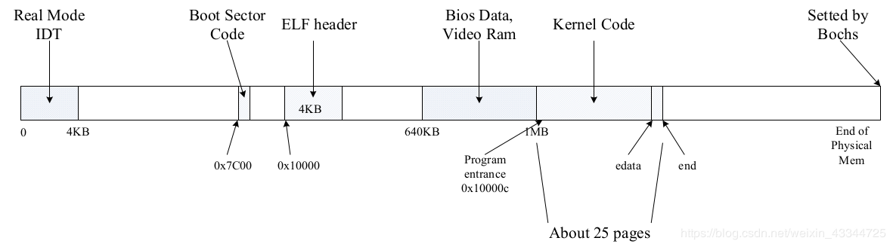

# JOS实验lab2 内存管理

[TOC]

## 零、实验要求

[Lab2实验要求](./lab2实验要求.pdf)

> **组员:    1711351 李汶蔚   1711308常欢 1711347 李瑞峰**
> 完成情况及分工：

## 一、实验简介

本次实验包含5个练习，6个问题以及4个挑战任务，实验内容主要分为两部分：

##### (一)物理页面管理

**操作系统必须知道物理RAM的哪些部分是空闲的，哪些部分正在被使用。JOS以页（page)为单位管理PC的物理内存，从而可以使用MMU映射和保护每一片分配的内存。**

*任务：完成物理页分配器。它用于保存哪些页面是空闲的，在数据的组织上，由struct Page对象构成的链表，每个Page结构都对应一个物理页。在完成虚拟内存实验之前，编写物理页分配器。*

##### (二)虚拟内存

**在x86术语中，虚拟地址由段选择器和段内的偏移组成。线性地址是在段转换之后，页转换之前的地址。物理地址是在段和页转换之后最终获得的最终地址，也就是最终在硬件总线上最后出现在RAM中的物理地址。**

*任务：为整个JOS设置虚拟内存布局，映射前256MB物理内存到虚拟地址0xf0000000处，并映射虚拟内存的其他区域。*

## 二、实验过程

#### 0：预备知识

在Lab1中，我们了解的PC物理地址存储结构如下

```

+------------------+  <- 0xFFFFFFFF (4GB)
|      32-bit      |
|  memory mapped   |
|     devices      |
|                  |
/\/\/\/\/\/\/\/\/\/\

/\/\/\/\/\/\/\/\/\/\
|                  |
|      Unused      |
|                  |
+------------------+  <- depends on amount of RAM
|                  |
|                  |
| Extended Memory  |
|                  |
|                  |
+------------------+  <- 0x00100000 (1MB)
|     BIOS ROM     |
+------------------+  <- 0x000F0000 (960KB)
|  16-bit devices, |
|  expansion ROMs  |
+------------------+  <- 0x000C0000 (768KB)
|   VGA Display    |
+------------------+  <- 0x000A0000 (640KB)
|                  |
|    Low Memory    |
|                  |
+------------------+  <- 0x00000000
```

整个Lab1实验流程下来，可以更加明确（图来自[sssaltyfish的博客](https://blog.csdn.net/weixin_43344725/article/details/89175115)）



在`inc/memlayout.h`中，虚拟内存结构如下：

```cpp

/*
 * Virtual memory map:                                Permissions
 *                                                    kernel/user
 *
 *    4 Gig -------->  +------------------------------+
 *                     |                              | RW/--
 *                     ~~~~~~~~~~~~~~~~~~~~~~~~~~~~~~~~
 *                     :              .               :
 *                     :              .               :
 *                     :              .               :
 *                     |~~~~~~~~~~~~~~~~~~~~~~~~~~~~~~| RW/--
 *                     |                              | RW/--
 *                     |   Remapped Physical Memory   | RW/--
 *                     |                              | RW/--
 *    KERNBASE ----->  +------------------------------+ 0xf0000000
 *                     |       Empty Memory (*)       | --/--  PTSIZE
 *    KSTACKTOP ---->  +------------------------------+ 0xefc00000      --+
 *                     |         Kernel Stack         | RW/--  KSTKSIZE   |
 *                     | - - - - - - - - - - - - - - -|                 PTSIZE
 *                     |      Invalid Memory (*)      | --/--             |
 *    ULIM     ------> +------------------------------+ 0xef800000      --+
 *                     |  Cur. Page Table (User R-)   | R-/R-  PTSIZE
 *    UVPT      ---->  +------------------------------+ 0xef400000
 *                     |          RO PAGES            | R-/R-  PTSIZE
 *    UPAGES    ---->  +------------------------------+ 0xef000000
 *                     |           RO ENVS            | R-/R-  PTSIZE
 * UTOP,UENVS ------>  +------------------------------+ 0xeec00000
 * UXSTACKTOP -/       |     User Exception Stack     | RW/RW  PGSIZE
 *                     +------------------------------+ 0xeebff000
 *                     |       Empty Memory (*)       | --/--  PGSIZE
 *    USTACKTOP  --->  +------------------------------+ 0xeebfe000
 *                     |      Normal User Stack       | RW/RW  PGSIZE
 *                     +------------------------------+ 0xeebfd000
 *                     |                              |
 *                     |                              |
 *                     ~~~~~~~~~~~~~~~~~~~~~~~~~~~~~~~~
 *                     .                              .
 *                     .                              .
 *                     .                              .
 *                     |~~~~~~~~~~~~~~~~~~~~~~~~~~~~~~|
 *                     |     Program Data & Heap      |
 *    UTEXT -------->  +------------------------------+ 0x00800000
 *    PFTEMP ------->  |       Empty Memory (*)       |        PTSIZE
 *                     |                              |
 *    UTEMP -------->  +------------------------------+ 0x00400000      --+
 *                     |       Empty Memory (*)       |                   |
 *                     | - - - - - - - - - - - - - - -|                   |
 *                     |  User STAB Data (optional)   |                 PTSIZE
 *    USTABDATA ---->  +------------------------------+ 0x00200000        |
 *                     |       Empty Memory (*)       |                   |
 *    0 ------------>  +------------------------------+                 --+
 *
 * (*) Note: The kernel ensures that "Invalid Memory" (ULIM) is *never*
 *     mapped.  "Empty Memory" is normally unmapped, but user programs may
 *     map pages there if desired.  JOS user programs map pages temporarily
 *     at UTEMP.
 */
```

#### Exercise 1：编写物理页分配器

**页表管理：**每个页目录表有1024个页目录项，每个页目录项占用4字节，一个页目录表占4KB内存。而每个页目录项都指向一个有1024个页表项的页表，每个页表项也占用4字节，因此JOS中页目录和页表一共要占用 1025 * 4KB = 4100KB 约4MB的内存。而通常我们说每个用户进程虚拟地址空间为4GB，其实就是每个进程都有一个页目录表，进程运行时将页目录地址装载到CR3寄存器中，从而每个进程最大可以用4GB内存。在JOS中，为了简单起见，只用了一个页目录表，整个系统的线性地址空间4GB是被内核和所有其他的用户程序所共用的。

```c++
在文件kern/pmap.c中，必须实现以下函数的代码（可能按照给定的顺序）。

boot_alloc()
mem_init()（仅完成调用check_page_free_list(1) 之前的部分）
page_init()
page_alloc()
page_free()

check_page_free_list()和check_page_alloc()会测试你的物理页面分配器。你应该启动JOS并查看check_page_alloc() 是否报告成功。修改代码，并确定能够通过它的测试。你可以添加自己的assert()来验证你的假设是否正确。
```

首先，查看pmap.c文件，发现其包含了两个很重要的头文件，分别是：`#include <inc/mmu.h>`和`#include <kern/pmap.h>`，对这两个文件进行宏观上的认识：

##### (一) <inc/mmu.h>

该文件中包含三部分：

**第一部分是页机制中32位地址的划分，最高10位作为PDX（页目录下标），接着10位作为PTX（页表下标），低10位是页偏移。**

```c++
// +--------10------+-------10-------+---------12----------+
// | Page Directory |   Page Table   | Offset within Page  |
// |      Index     |      Index     |                     |
// +----------------+----------------+---------------------+
//  \--- PDX(la) --/ \--- PTX(la) --/ \---- PGOFF(la) ----/
//  \---------- PGNUM(la) ----------/
```

**并且定义了一些常量，包括获取各个部分的偏移量、页大小、页表项的各个标志位、以及页缺失等常量。**

**第二部分是定义与段机制有关的数据结构与常量，如struct Segdesc。**

**第三部分是定义了Trap中断用到的数据结构和常量，如struct Taskstate、struct Gatedesc、struct Pseudodesc等。**

##### (二) <kern/pmap.h>

在该文件中，又引入了一个很重要的文件`#include <inc/memlayout.h>`	。

在**memlayout.h**中展示了Jos内存的存储情况即内存的布局，并定义了每个内存段的起始地址和大小，将内存分成了几个部分。

**PGSIZE：4096字节（页大小）； PTSIZE：1024 x 4096(1024个页)**;

**定义了描述物理页的数据结构：**

```c++
struct Page {
	// Next page on the free list.
	struct Page *pp_link;

	// pp_ref is the count of pointers (usually in page table entries)
	// to this page, for pages allocated using page_alloc.
	// Pages allocated at boot time using pmap.c's
	// boot_alloc do not have valid reference count fields.

	uint16_t pp_ref;
};
```

<hr>
**pmap.h中除了定义了pmap.c中要完成的那几个代码之外，还定义了几个重要的内联函数（页面操作函数）：**

```c++
extern char bootstacktop[], bootstack[];

extern struct Page *pages;
extern size_t npages;

extern pde_t *kern_pgdir;

#define KADDR(pa) _kaddr(__FILE__, __LINE__, pa)//物理地址转虚拟地址
#define PADDR(kva) _paddr(__FILE__, __LINE__, kva)//虚拟地址转物理地址
static inline physaddr_t
page2pa(struct Page *pp) //得到该 Page结构对应的物理内存的起始位置
{
	return (pp - pages) << PGSHIFT; //PGSHIFT = 12 ; 2^12 = 4096字节
}
```

```c++
static inline struct Page*
pa2page(physaddr_t pa) //// 由物理地址得到Page结构体
{
	if (PGNUM(pa) >= npages)
		panic("pa2page called with invalid pa");
	return &pages[PGNUM(pa)];
}
```

```c++
static inline void* 
page2kva(struct Page *pp)// 返回Page结构pp所对应的物理页面的虚拟地址
{
	return KADDR(page2pa(pp));
}
```

##### (三）练习解答

**至此，我们知道内存管理分配需要的数据结构和函数已定义完成，我们分析pmap.c这个文件，并完成练习一，代码如下。**

```c++
//pmap.c
// These variables are set by i386_detect_memory()
size_t npages;			// Amount of physical memory (in pages)
static size_t npages_basemem;	// Amount of base memory (in pages)

// These variables are set in mem_init()
pde_t *kern_pgdir;		// Kernel's initial page directory
struct Page *pages;		// Physical page state array
static struct Page *page_free_list;	// Free list of physical pages
```

1. boot_alloc() 

```c++
// 字节单位申请内存，page_alloc()实现后便不再用。
cprintf("boot_alloc memory at %x\n", nextfree);
cprintf("Next memory at %x\n", ROUNDUP((char *) (nextfree+n), PGSIZE));
	if (n != 0) 
	{
		char *next = nextfree;
		nextfree = ROUNDUP((char *) (nextfree+n), PGSIZE);
		return next;
	} 
	else 
		return nextfree;
```

2. mem_init()

```c++
//内存功能初始化，只负责内核地址部分。
pages = (struct Page*)boot_alloc(npages * sizeof(struct Page));//分配npages个页*Page结构体大小个字节的空间
memset(pages, 0, npages * sizeof(struct Page));//初始化为0
```

3. page_init()

```c++
//初始化物理页框表。
// However this is not truly the case.  What memory is free?
	//  1) Mark physical page 0 as in use.
	//     This way we preserve the real-mode IDT and BIOS structures
	//     in case we ever need them.  (Currently we don't, but...)
	pages[0].pp_ref = 1;
	//  2) The rest of base memory, [PGSIZE, npages_basemem * PGSIZE)
	//     is free.
	size_t i;	//page_free_list指向最后一个分配的页,pp_link指向前一个空闲页
	//把所有空闲页串起来
	for (i = 1; i < npages_basemem; i++) {
		pages[i].pp_ref = 0;
		pages[i].pp_link = page_free_list;
		page_free_list = &pages[i];
	}
	//  3) Then comes the IO hole [IOPHYSMEM, EXTPHYSMEM), which must
	//     never be allocated.
	for(i = IOPHYSMEM / PGSIZE; i < EXTPHYSMEM/PGSIZE;i++)
	{
		pages[i].pp_ref = 1;
	}
	//  4) Then extended memory [EXTPHYSMEM, ...).
	//     Some of it is in use, some is free. Where is the kernel
	//     in physical memory?  Which pages are already in use for
	//     page tables and other data structures?

	size_t first_free_paddr = PADDR(boot_alloc(0));
	for(i = EXTPHYSMEM / PGSIZE; i < first_free_paddr / PGSIZE;i++)
	{
		pages[i].pp_ref = 1;
	}

	for(i = first_free_paddr / PGSIZE; i < npages; i++)
	{
		pages[i].pp_ref = 0;
		pages[i].pp_link = page_free_list;
		page_free_list = &pages[i];
	}
```

4. page_alloc()

```c++
//物理页分配
```

4. page_free()

```c++
//物理页释放
```


## 三、问题讨论


