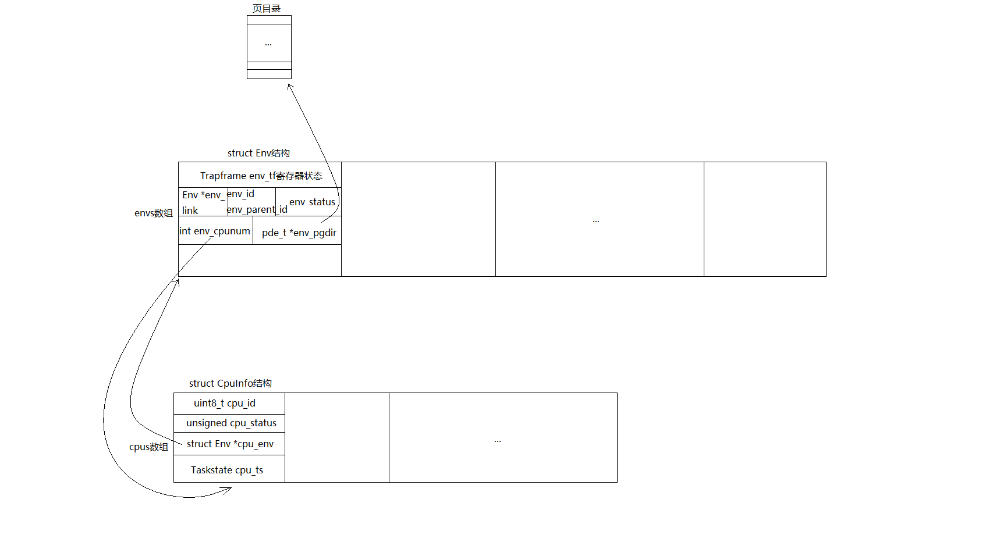
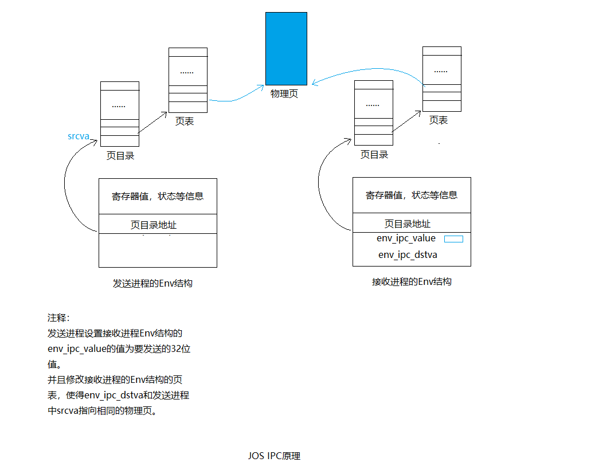

# Lab 4: Preemptive Multitasking / 抢占式多任务处理

[TOC]

> **组员：李瑞峰 1711347 李汶蔚 1711352 常欢 1711308**

完成情况:

+ 全部练习

## 实验概括

 本次lab的4个方面

1. 支持多处理器

   

2. 实现**进程调度**算法。 一种是非抢占式式的，另一种是抢占式的，借助时钟中断实现，时钟中断到来时，内核调用sched_yield()选择另一个Env结构执行。

3. 实现写时拷贝fork（**进程创建**）。fork()是库函数，会调用sys_exofork(void)这个系统调用，该系统调用在内核中为子进程创建一个新的Env结构，然将父进程的寄存器状态复制给该Env结构，复制页表，对于PTE_W为1的页目录，复制的同时，设置PTE_COW标志。

4. 实现**进程间通信**。本质还是进入内核修改Env结构的的页映射关系。原理总结如下：

   


## 实验知识总结

### 1 "symmetric multiprocessing" (SMP)

"symmetric multiprocessing" (SMP)，这是一种所有CPU共享系统资源的多处理器模式。在启动阶段这些CPU将被分为两类：

1. 启动CPU（BSP）：负责初始化系统，启动操作系统。

2. 应用CPU（AP）：操作系统启动后由BSP激活：

   哪一个CPU是BSP由硬件和BISO决定，到目前位置所有JOS代码都运行在BSP上。
   在SMP系统中，每个CPU都有一个对应的local APIC（LAPIC），负责传递中断。CPU通过内存映射IO(MMIO)访问它对应的APIC，这样就能通过访问内存达到访问设备寄存器的目的。LAPIC从物理地址0xFE000000开始，JOS将通过MMIOBASE虚拟地址访问该物理地址。

### 2 CPUInfo

```c++
struct CpuInfo {
    uint8_t cpu_id;                 // Local APIC ID; index into cpus[] below
    volatile unsigned cpu_status;   // The status of the CPU
    struct Env *cpu_env;            // The currently-running environment.
    struct Taskstate cpu_ts;        // Used by x86 to find stack for interrupt
};
```

每个CPU如下信息是当前CPU私有的：

1. 内核栈：内核代码中的数组`percpu_kstacks[NCPU][KSTKSIZE]`为每个CPU都保留了KSTKSIZE大小的内核栈。从内核线性地址空间看CPU 0的栈从KSTACKTOP开始，CPU 1的内核栈将从CPU 0栈后面KSTKGAP字节处开始，以此类推，参见inc/memlayout.h。
2. TSS和TSS描述符：每个CPU都需要单独的TSS和TSS描述符来指定该CPU对应的内核栈。
3. 进程结构指针：每个CPU都会独立运行一个进程的代码，所以需要Env指针。
4. 系统寄存器：比如cr3, gdt, ltr这些寄存器都是每个CPU私有的，每个CPU都需要单独设置。

**envs和CpuInfo关系如下图**


### 3 mem_int_mp（）

```c++
*    KERNBASE, ---->  +------------------------------+ 0xf0000000      --+
*    KSTACKTOP        |     CPU0's Kernel Stack      | RW/--  KSTKSIZE   |
*                     | - - - - - - - - - - - - - - -|                   |
*                     |      Invalid Memory (*)      | --/--  KSTKGAP    |
*                     +------------------------------+                   |
*                     |     CPU1's Kernel Stack      | RW/--  KSTKSIZE   |
*                     | - - - - - - - - - - - - - - -|                 PTSIZE
*                     |      Invalid Memory (*)      | --/--  KSTKGAP    |
*                     +------------------------------+                   |
*                     :              .               :                   |
*                     :              .               :                   |
*    MMIOLIM ------>  +------------------------------+ 0xefc00000      --+
```

## 练习部分

### PART：A

### Exercise 1


>问题：
>
>实现在 `kern/pmap.c` 中的 `mmio_map_region` 方法。
>
>你可以看看 `kern/lapic.c` 中 `lapic_init` 的开头部分，了解一下它是如何被调用的。你还需要完成接下来的练习，你的 `mmio_map_region` 才能够正常运行。

```c++
void *
mmio_map_region(physaddr_t pa, size_t size)
{
    // Where to start the next region.  Initially, this is the
    // beginning of the MMIO region.  Because this is static, its
    // value will be preserved between calls to mmio_map_region
    // (just like nextfree in boot_alloc).
    static uintptr_t base = MMIOBASE;

    // Reserve size bytes of virtual memory starting at base and
    // map physical pages [pa,pa+size) to virtual addresses
    // [base,base+size).  Since this is device memory and not
    // regular DRAM, you'll have to tell the CPU that it isn't
    // safe to cache access to this memory.  Luckily, the page
    // tables provide bits for this purpose; simply create the
    // mapping with PTE_PCD|PTE_PWT (cache-disable and
    // write-through) in addition to PTE_W.  (If you're interested
    // in more details on this, see section 10.5 of IA32 volume
    // 3A.)
    //
    // Be sure to round size up to a multiple of PGSIZE and to
    // handle if this reservation would overflow MMIOLIM (it's
    // okay to simply panic if this happens).
    //
    // Hint: The staff solution uses boot_map_region.
    //
    // Your code here:
    size = ROUNDUP(pa+size, PGSIZE);
    pa = ROUNDDOWN(pa, PGSIZE);
    size -= pa;//做一个对齐
    if (base+size >= MMIOLIM) panic("not enough memory");
    boot_map_region(kern_pgdir, base, size, pa, PTE_PCD|PTE_PWT|PTE_W);
    base += size;
    return (void*) (base - size);
}
```

​		在SMP系统中，每个CPU都有一个对应的local APIC（LAPIC），负责传递中断。CPU通过内存映射IO(MMIO)访问它对应的APIC，这样就能通过访问内存达到访问设备寄存器的目的。LAPIC从物理地址0xFE000000开始，JOS将通过MMIOBASE虚拟地址访问该物理地址。

​		`boot_map_region`函数：

> Map [va, va+size) of virtual address space to physical [pa, pa+size)
>
> in the page table rooted at pgdir.  Size is a multiple of PGSIZE.
>
> Use permission bits perm|PTE_P for the entries.

​		该函数作用：给定物理地址和size，将pa-pa+size映射到MMIOBASE-MMIOBASE+size上，设置权限位告诉CPU这块内存不应该cache，是不安全的。

### Exercise 2：应用处理器（AP）引导程序

---

> 练习 2:
> 阅读 kern/init.c 中的 boot_aps() 和 mp_main() 方法，和 kern/mpentry.S 中的汇编代码。确保你已经明白了引导 AP 启动的控制流执行过程。
>
> 接着，修改你在 kern/pmap.c 中实现过的 page_init() 以避免将 MPENTRY_PADDR 加入到 free list 中，以使得我们可以安全地将 AP 的引导代码拷贝于这个物理地址并运行。

```c++
//在启动 AP 之前，BSP 应当首先收集多处理器系统的信息，例如，CPU总数，他们的 APIC ID，和 LAPIC单元 的 MMIO 地址。
// `boot_aps()` 函数驱动 AP 的引导过程。 AP 从实模式开始启动，就像 在 `boot/boot.S` 中的 bootloader 一样。所以 `boot_aps()` 将 AP 的入口代码 ( `kern/mpentry.S` ) 拷贝到一个实模式中能够访问到的内存地址。

size_t i, mp_page = PGNUM(MPENTRY_PADDR);
for (i = 1; i < npages_basemem; i++) 
{
  if (i == mp_page) continue;
  		pages[i].pp_ref=1;
}
```

#### 问题1

Q：为什么mpentry.S要用到MPBOOTPHYS，而boot.S不需要？

 这是因为mpentry.S代码mpentry_start, mpentry_end的地址都在KERNBASE(0xf0000000）之上，实模式无法寻址，而我们将mpentry.S加载到了0x7000处，所以需要通过MPBOOTPHYS来寻址。而boot.S加载的位置本身就是实模式可寻址的低地址，所以不用额外转换。

`boot.S`

```assembly
  lgdt    gdtdesc
  movl    %cr0, %eax
  orl     $CR0_PE_ON, %eax
  movl    %eax, %cr0
  
  ljmp    $PROT_MODE_CSEG, $protcseg
```

`mpentry.S`

```assembly
#define MPBOOTPHYS(s) ((s) - mpentry_start + MPENTRY_PADDR)
...
	lgdt    MPBOOTPHYS(gdtdesc)
	movl    %cr0, %eax
	orl     $CR0_PE, %eax
	movl    %eax, %cr0

	ljmpl   $(PROT_MODE_CSEG), $(MPBOOTPHYS(start32))
```

### Exercise 3：

---

> 问题：
>
> 修改 `mem_mp_init()`为每个cpu分配内核栈。CPU内核栈之间有空出KSTKGAP(32KB)，其目的是为了避免一个CPU的内核栈覆盖另外一个CPU的内核栈，空出来这部分可以在栈溢出时报错。每个堆栈的大小都是 `KSTKSIZE` 字节，加上 `KSTKGAP` 字节没有被映射的守护页 。

```c++
static void
mem_init_mp(void)
{
    // Map per-CPU stacks starting at KSTACKTOP, for up to 'NCPU' CPUs.
    //
    // For CPU i, use the physical memory that 'percpu_kstacks[i]' refers
    // to as its kernel stack. CPU i's kernel stack grows down from virtual
    // address kstacktop_i = KSTACKTOP - i * (KSTKSIZE + KSTKGAP), and is
    // divided into two pieces, just like the single stack you set up in
    // mem_init:
    //     * [kstacktop_i - KSTKSIZE, kstacktop_i)
    //          -- backed by physical memory
    //     * [kstacktop_i - (KSTKSIZE + KSTKGAP), kstacktop_i - KSTKSIZE)
    //          -- not backed; so if the kernel overflows its stack,
    //             it will fault rather than overwrite another CPU's stack.
    //             Known as a "guard page".
    //     Permissions: kernel RW, user NONE
    //
    // LAB 4: Your code here:
    for (int i = 0; i < NCPU; i++) 
    {
        boot_map_region(kern_pgdir, 
            KSTACKTOP - KSTKSIZE - i * (KSTKSIZE + KSTKGAP), 
            KSTKSIZE, 
            PADDR(percpu_kstacks[i]), 
            PTE_W);
    }
}
```

映射方式按照memlayout.h中即可，布局图在前头。

### Exercize 4

---

> 修改`trap_init_percpu()`，完成每个CPU的TSS初始化。设置ts_esp0和ts_ss0。

```c++
// Hints:
	//   - The macro "thiscpu" always refers to the current CPU's
	//     struct CpuInfo;
	//   - The ID of the current CPU is given by cpunum() or
	//     thiscpu->cpu_id;
	//   - Use "thiscpu->cpu_ts" as the TSS for the current CPU,
	//     rather than the global "ts" variable;
	//   - Use gdt[(GD_TSS0 >> 3) + i] for CPU i's TSS descriptor;
void
trap_init_percpu(void)
{
    int cpu_id = thiscpu->cpu_id;
    struct Taskstate *this_ts = &thiscpu->cpu_ts;
  	//上面为多个CPU分配了内核栈
    this_ts->ts_esp0 = KSTACKTOP - cpu_id * (KSTKSIZE + KSTKGAP);
    this_ts->ts_ss0 = GD_KD;
    this_ts->ts_iomb = sizeof(struct Taskstate);
		//在lab3基础上修改以上代码
  	//把ts换成this_ts，并遵循hint4进行更改
    gdt[(GD_TSS0 >> 3) + cpu_id] = SEG16(STS_T32A, (uint32_t) (this_ts),
                    sizeof(struct Taskstate) - 1, 0); 
    gdt[(GD_TSS0 >> 3) + cpu_id].sd_s = 0;
  
    ltr(GD_TSS0 + (cpu_id << 3));
    lidt(&idt_pd);
}
```

函数梗概：为 BSP 初始化了 TSS 和 TSS描述符。

### Exercize 5

---

> 在上述提到的位置使用内核锁，加锁时使用 lock_kernel()， 释放锁时使用 unlock_kernel()。
>
> 
>
> + `i386_init()` 中，在 BSP 唤醒其他 CPU 之前获得内核锁。
> + `mp_main()` 中，在初始化完 AP 后获得内核锁，接着调用 `sched_yield()` 来开始在这个 AP 上运行进程。
> + `trap()` 中，从用户模式陷入(trap into)内核模式之前获得锁。你可以通过检查 `tf_cs` 的低位判断这一 trap 发生在用户模式还是内核模式（译注：Lab 3 中曾经使用过这一检查）。
> + env_run() 中，恰好在 **回到用户进程之前** 释放内核锁。不要太早或太晚做这件事，否则可能会出现竞争或死锁。

`lock_kernel()`调用了`spin_lock()`函数，`unlock_kernel()`调用了`spin_unlock()`函数。

对于spin_lock()获取锁的操作，使用xchgl这个原子指令，xchg()封装了该指令，交换lk->locked和1的值，并将lk-locked原来的值返回。


```c++
void i386_init(void)
{
	...
	// Acquire the big kernel lock before waking up APs
	// Your code here:
	lock_kernel();
	// Starting non-boot CPUs
	boot_aps();
	...
}
void mp_main(void)
{
	...
	// Your code here:
	lock_kernel();
  sched_yield();
	// Remove this after you finish Exercise 4
	//for (;;);
	...
}

void trap(struct Trapframe *tf)
{
	...
	if ((tf->tf_cs & 3) == 3) {
		// Trapped from user mode.
		// Acquire the big kernel lock before doing any
		// serious kernel work.
		// LAB 4: Your code here.
		lock_kernel();
		assert(curenv);
		...
		}
}
void env_run(struct Env *e)
{
  // LAB 3: Your code here.
	if(curenv != NULL && curenv != e)
	{
		curenv->env_status = ENV_RUNNABLE;
	}
	if(curenv != e)
	{
		curenv = e;
		curenv->env_status = ENV_RUNNING;
		curenv->env_runs++;
		lcr3(PADDR(curenv->env_pgdir));
	}
	env_pop_tf(&curenv->env_tf);
	unlock_kernel();//释放内核锁，该函数将使用iret指令，从内核返回用户态。
}
```

#### 问题 2

> 为什么有了大内核锁后还要给每个CPU分配一个内核栈？ 

这是因为虽然大内核锁限制了多个进程同时执行内核代码，但是在陷入trap()之前，CPU硬件已经自动压栈了SS, ESP, EFLAGS, CS, EIP等寄存器内容，而且在`trapentry.S`中也压入了错误码和中断号到内核栈中，所以不同CPU必须分开内核栈，否则多个CPU同时陷入内核时会破坏栈结构，此时都还没有进入到trap()的加大内核锁位置。


举例：假设CPU0因中断陷入内核并在内核栈中保留了相关的信息，此时若CPU1也发生中断而陷入内核，在同一个内核栈的情况下，CPU0中的信息将会被覆盖从而导致出现错误。

### Exercize 6

---

- `kern/sched.c` 中的 `sched_yied()` 函数负责挑选一个进程运行。它从刚刚在运行的进程开始，按顺序循环搜索 `envs[]` 数组（如果从来没有运行过进程，那么就从数组起点开始搜索），选择它遇到的第一个处于 `ENV_RUNNABLE`（参考 `inc/env.h`）状态的进程，并调用 `env_run()` 来运行它。
- `sched_yield()` 绝不应当在两个CPU上同时运行同一进程。它可以分辨出一个进程正在其他CPU（或者就在当前CPU）上运行，因为这样的进程处于 `ENV_RUNNING` 状态。
- 用户进程可以调用它来触发内核的 `sched_yield()` 方法，自愿放弃 CPU，给其他进程运行。

```c++
// 修改kern/sched.c中调度函数实现
void
sched_yield(void)
{
	struct Env *idle;

	idle = curenv;
	int start_envid = idle ? ENVX(idle->env_id)+1 : 0; 
  //如果当前有存在Env，从当前Env结构的后一个开始
  //否则，从0开始

	for (int i = 0; i < NENV; i++) 
  { //遍历所有Env结构
		int j = (start_envid + i) % NENV;
		if (envs[j].env_status == ENV_RUNNABLE) 
    {
			env_run(&envs[j]);
		}
	}
	//no envs are runnable, but the environment previously
	// running on this CPU is still ENV_RUNNING
	if (idle && idle->env_status == ENV_RUNNING) 
  { //这是必须的，假设当前只有一个Env，如果没有这个判断，那么这个CPU将会停机
		env_run(idle);
	}

	// sched_halt never returns
	sched_halt();
}
//修改kern/syscall.c
int32_t
syscall(uint32_t syscallno, uint32_t a1, uint32_t a2, uint32_t a3, uint32_t a4, uint32_t a5)
{
  ...
  case SYS_yield:
               sys_yield();
               return 0;
  ...
}
//修改kern/init.c
void
i386_init(void)
{
  ...	//添加三个新的进程，运行 user/yield.c
       ENV_CREATE(user_yield, ENV_TYPE_USER);
       ENV_CREATE(user_yield, ENV_TYPE_USER);
       ENV_CREATE(user_yield, ENV_TYPE_USER);
  ...
}

```

#### 问题 3

> 在你实现的 `env_run()` 中你应当调用了 `lcr3()`。在调用 `lcr3()` 之前和之后，你的代码应当都在引用 变量 `e`，就是 `env_run()` 所需要的参数。 在装载 `%cr3` 寄存器之后， MMU 使用的地址上下文立刻发生改变，但是处在之前地址上下文的虚拟地址（比如说 `e` ）却还能够正常工作，为什么 `e` 在地址切换前后都可以被正确地解引用呢？

这是因为所有的进程env_pgdir的高地址的映射跟kern_pgdir的是一样的，除了`UVPT`外。

#### 问题 4

> 为什么要保证我们的进程保存了寄存器状态，在哪里保存的？

当发生地址转换时一定是从用户陷入内核之后，无论以何种方式陷入内核，必须要经过`kern/trap.c`中的`trap()`函数。如下，当从用户模式陷入内核时，代码将内核栈中的`tf`（包括页表和寄存器等）拷贝至内核间共享的对应的`env`中，所以之后寄存器状态才能恢复。

```c++
// Copy trap frame (which is currently on the stack)
		// into 'curenv->env_tf', so that running the environment
		// will restart at the trap point.
		curenv->env_tf = *tf;
```


### Exercise7

> 在 `kern/syscall.c` 中实现上面描述的系统调用。你将需要用到在 `kern/pmap.c` 和 `kern/env.c` 中定义的多个函数，尤其是 `envid2env()`。此时，无论何时你调用 `envid2env()`，都应该传递 1 给 `checkperm` 参数。确定你检查了每个系统调用参数均合法，否则返回 `-E_INVAL`。 用 `user/dumbfork` 来测试你的 JOS 内核，在继续前确定它正常的工作。（`make run-dumbfork`）

实现上述所有的系统调用：

#### sys_exofork(void)：

该系统调用创建一个几乎完全空白的新进程：它的用户地址空间没有内存映射，也不可以运行。这个新的进程拥有和创建它的父进程（调用这一方法的进程）一样的寄存器状态。在父进程中，`sys_exofork` 会返回刚刚创建的新进程的 `envid_t`（或者一个负的错误代码，如果进程分配失败）。在子进程中，它应当返回0。（因为子进程开始时被标记为不可运行，`sys_exofork` 并不会真的返回到子进程，除非父进程显式地将其标记为可以运行以允许子进程运行。

```c++
static envid_t
sys_exofork(void)
{
    // Create the new environment with env_alloc(), from kern/env.c.
    // It should be left as env_alloc created it, except that
    // status is set to ENV_NOT_RUNNABLE, and the register set is copied
    // from the current environment -- but tweaked so sys_exofork
    // will appear to return 0.

    // LAB 4: Your code here.
    struct Env *e;
    int ret = env_alloc(&e, curenv->env_id);    //分配一个Env结构
    if (ret < 0) 
    {
        return ret;
    }
    e->env_tf = curenv->env_tf;         //寄存器状态和当前进程一致
    e->env_status = ENV_NOT_RUNNABLE;   //目前还不能运行
    e->env_tf.tf_regs.reg_eax = 0;      //新的进程从sys_exofork()的返回值应该为0，修改返回值
    return e->env_id;
}
```

#### sys_env_set_status(envid_t envid, int status):

参数为进程ID和希望设置的状态码（ `ENV_RUNNABLE` 或 `ENV_NOT_RUNNABLE`）构成中要检查状态是否合法，是否有权限设置。

```c++
static int
sys_env_set_status(envid_t envid, int status)
{
    // Hint: Use the 'envid2env' function from kern/env.c to translate an
    // envid to a struct Env.
    // You should set envid2env's third argument to 1, which will
    // check whether the current environment has permission to set
    // envid's status.
    if (status != ENV_NOT_RUNNABLE && status != ENV_RUNNABLE) return -E_INVAL;

    struct Env *e;
    int ret = envid2env(envid, &e, 1);
    if (ret < 0)
    {
        return ret;
    }
    e->env_status = status;
    return 0;
}
```

#### sys_page_alloc(envid_t envid, void *va, int perm):

分配一个物理内存页面，并将它映射在给定进程虚拟地址空间的给定虚拟地址上。

```c++
static int
sys_page_alloc(envid_t envid, void *va, int perm)
{
    // Hint: This function is a wrapper around page_alloc() and
    //   page_insert() from kern/pmap.c.
    //   Most of the new code you write should be to check the
    //   parameters for correctness.
    //   If page_insert() fails, remember to free the page you
    //   allocated!

    // LAB 4: Your code here.
    struct Env *e;                                  //根据envid找出需要操作的Env结构
    int ret = envid2env(envid, &e, 1);
    if (ret) 
      return ret;    //bad_env

    if ((va >= (void*)UTOP) || (ROUNDDOWN(va, PGSIZE) != va)) 
      	return -E_INVAL; //一系列判定
    int flag = PTE_U | PTE_P;
    if ((perm & flag) != flag) return -E_INVAL;

    struct PageInfo *pg = page_alloc(1);            //分配物理页
    if (!pg) 
      return -E_NO_MEM;
    ret = page_insert(e->env_pgdir, pg, va, perm);  //建立映射关系
    if (ret)
    {
        page_free(pg);
        return ret;
    }

    return 0;
}
```

#### sys_page_map(envid_t srcenvid, void *srcva,envid_t dstenvid, void* dstva, int perm):

从一个进程的地址空间拷贝一个页的映射 (**不是** 页的内容) 到另一个进程的地址空间，新进程和旧进程的映射应当指向同一个物理内存区域，使两个进程得以共享内存。

```c++
static int
sys_page_map(envid_t srcenvid, void *srcva,
         envid_t dstenvid, void *dstva, int perm)
{
    // Hint: This function is a wrapper around page_lookup() and
    //   page_insert() from kern/pmap.c.
    //   Again, most of the new code you write should be to check the
    //   parameters for correctness.
    //   Use the third argument to page_lookup() to
    //   check the current permissions on the page.

    // LAB 4: Your code here.
    struct Env *se, *de;
    int ret = envid2env(srcenvid, &se, 1);
    if (ret) return ret;    //bad_env
    ret = envid2env(dstenvid, &de, 1);
    if (ret) return ret;    //bad_env

    //  -E_INVAL if srcva >= UTOP or srcva is not page-aligned,
    //      or dstva >= UTOP or dstva is not page-aligned.
    if (srcva >= (void*)UTOP || dstva >= (void*)UTOP || 
        ROUNDDOWN(srcva,PGSIZE) != srcva || ROUNDDOWN(dstva,PGSIZE) != dstva) 
        return -E_INVAL;

    //  -E_INVAL is srcva is not mapped in srcenvid's address space.
    pte_t *pte;
    struct PageInfo *pg = page_lookup(se->env_pgdir, srcva, &pte);
    if (!pg) return -E_INVAL;

    //  -E_INVAL if perm is inappropriate (see sys_page_alloc).
    int flag = PTE_U|PTE_P;
    if ((perm & flag) != flag) return -E_INVAL;

    //  -E_INVAL if (perm & PTE_W), but srcva is read-only in srcenvid's
    //      address space.
    if (((*pte&PTE_W) == 0) && (perm&PTE_W)) return -E_INVAL;

    //  -E_NO_MEM if there's no memory to allocate any necessary page tables.
    ret = page_insert(de->env_pgdir, pg, dstva, perm);
    return ret;

}
```

#### sys_page_unmap(envid_t envid, void *va):

取消给定进程在给定虚拟地址的页映射。

```C++
static int
sys_page_unmap(envid_t envid, void *va)
{
    // Hint: This function is a wrapper around page_remove().

    // LAB 4: Your code here.
    struct Env *env;
    int ret = envid2env(envid, &env, 1);
    if (ret) return ret;

    if ((va >= (void*)UTOP) || (ROUNDDOWN(va, PGSIZE) != va)) return -E_INVAL;
    page_remove(env->env_pgdir, va);
    return 0;
}
```

### PART B：Copy-on-Write Fork

### Exercise8

> 实现 `sys_env_set_pgfault_upcall` 系统调用。因为这是一个 “危险” 的系统调用，不要忘记在获得目标进程信息时启用权限检查。

```c++
static int 
sys_env_set_pgfault_upcall(envid_t envid, void *func)
{
    struct Env *e; 
    if (envid2env(envid, &e, 1))
      return -E_BAD_ENV;
    e->env_pgfault_upcall = func;
    return 0;
}
```

该系统调用为指定的用户环境设置env_pgfault_upcall，缺页中断发生时，会执行env_pgfault_upcall指定位置的代码。

### Exercise9

> 实现在 `kern/trap.c` 中的 `page_fault_handler` 方法，使其能够将缺页分发给用户模式缺页处理函数。确认你在写入异常堆栈时已经采取足够的预防措施了。（如果用户进程的异常堆栈已经没有空间了会发生什么？）

缺页中断发生时会进入内核的trap()，然后分配page_fault_handler()来处理缺页中断。在该函数中应该做如下几件事：

1. 判断curenv->env_pgfault_upcall是否设置，如果没有设置也就没办法修复，直接销毁该进程。
2. 修改esp，切换到用户异常栈。
3. 在栈上压入一个UTrapframe结构。
4. 将eip设置为curenv->env_pgfault_upcall，然后回到用户态执行curenv->env_pgfault_upcall处的代码。

```c++
void 
page_fault_handler(Trapframe *tf)
{
    ...
    // LAB 4: Your code here.
    if (curenv->env_pgfault_upcall) 
    {
        struct UTrapframe *utf;
      //如果在异常栈内发生了缺页，则为EIP多保留4个字节
        if (tf->tf_esp >= UXSTACKTOP-PGSIZE && tf->tf_esp <= UXSTACKTOP-1) {
            utf = (struct UTrapframe *)(tf->tf_esp - sizeof(struct UTrapframe) - 4); 
        } else {
            utf = (struct UTrapframe *)(UXSTACKTOP - sizeof(struct UTrapframe));
        }   

        user_mem_assert(curenv, (void*)utf, 1, PTE_W);
        utf->utf_fault_va = fault_va;
        utf->utf_err = tf->tf_err;
        utf->utf_regs = tf->tf_regs;
        utf->utf_eip = tf->tf_eip;
        utf->utf_eflags = tf->tf_eflags;
        utf->utf_esp = tf->tf_esp;

        curenv->env_tf.tf_eip = (uintptr_t)curenv->env_pgfault_upcall;
        curenv->env_tf.tf_esp = (uintptr_t)utf;
        env_run(curenv);
    } 
    ...
} 
```

### Exercise10

> 实现在 `lib/pfentry.S` 中的 `_pgfault_upcall` 例程。返回到一开始运行造成缺页的用户代码这一部分很有趣。你在这里将会直接返回，而不是通过内核。最难的部分是同时调整堆栈并重新装载 EIP。

以下是UTrapframe结构，根据这个结构，然后完成练习10，就是找到缺页时的eip，压到缺页时的栈里，再通过ret返回。

```c++
                   <-- UXSTACKTOP
trap-time esp
trap-time eflags
trap-time eip
trap-time eax       start of struct PushRegs
trap-time ecx
trap-time edx
trap-time ebx
trap-time esp
trap-time ebp
trap-time esi
trap-time edi       end of struct PushRegs
tf_err (error code)
fault_va            <-- %esp when handler is run
```

```c++
_pgfault_upcall:
        ...
    // LAB 4: Your code here.
    addl $8, %esp           //跳过utf_fault_va和utf_err
    movl 40(%esp), %eax     //保存中断发生时的esp到eax
    movl 32(%esp), %ecx     //保存终端发生时的eip到ecx
    movl %ecx, -4(%eax)     //将中断发生时的eip值亚入到到原来的栈中
    popal
    addl $4, %esp           //跳过eip

    // Restore eflags from the stack.  After you do this, you can
    // no longer use arithmetic operations or anything else that
    // modifies eflags.
    // LAB 4: Your code here.
    popfl
    // Switch back to the adjusted trap-time stack.
    // LAB 4: Your code here.
    popl %esp
    // Return to re-execute the instruction that faulted.
    // LAB 4: Your code here.
    lea -4(%esp), %esp      //因为之前压入了eip的值但是没有减esp的值，所以现在需要将esp寄存器中的值减4
    ret
```

### Exercise 11

> 完成在 `lib/pgfault.c` 中的 `set_pgfault_handler()` 。

```c++
void
set_pgfault_handler(void (*handler)(struct UTrapframe *utf))
{
    int r;

    if (_pgfault_handler == 0) 
    {
        // First time through!
        // LAB 4: Your code here.
        int r = sys_page_alloc(0, (void *)(UXSTACKTOP-PGSIZE), PTE_W | PTE_U | PTE_P);  //为当前进程分配异常栈
        if (r < 0) {
            panic("set_pgfault_handler:sys_page_alloc failed");;
        }
        sys_env_set_pgfault_upcall(0, _pgfault_upcall);     //系统调用，设置进程的env_pgfault_upcall属性
    }

    // Save handler pointer for assembly to call.
    _pgfault_handler = handler;
}
```

用户模式下就可以通过这个函数，传入页缺失处理函数的函数指针，设置进程的env_pgfault_upcall属性，完成页缺失的处理函数注册。当产生页缺失中断时，就能完成页缺失的处理。

### Exercise 12

> 实现在 `lib/fork.c` 中的 `fork`，`duppage` 和 `pgfault`。

pgfault做的工作是首先检查一下缺页原因，是否为写造成的页缺失，且缺失的页面被标记为写时复制，否则，panic。

然后将一个暂时的虚拟地址PFTEMP也映射到缺失的物理页，并将缺失的虚拟地址addr新分配一个物理页，与其建立映射，最后将PFTEMP映射的缺失物理页拷贝到新的物理页，取消PFTEMP的映射，完成整个工作。

```c++
static void
pgfault(struct UTrapframe *utf)
{
	void *addr = (void *) utf->utf_fault_va;
	uint32_t err = utf->utf_err;
	int r;

	// Check that the faulting access was (1) a write, and (2) to a
	// copy-on-write page.  If not, panic.
	// Hint:
	//   Use the read-only page table mappings at uvpt
	//   (see <inc/memlayout.h>).

	// LAB 4: Your code here.
	if (!((err & FEC_WR) && (uvpt[PGNbUM(addr)] & PTE_COW)))
	 { //只有因为写操作写时拷贝的地址才可以抢救。否则一律panic
		panic("pgfault():not cow");
	}

	// Allocate a new page, map it at a temporary location (PFTEMP),
	// copy the data from the old page to the new page, then move the new
	// page to the old page's address.
	// Hint:
	//   You should make three system calls.

	// LAB 4: Your code here.
	addr = ROUNDDOWN(addr, PGSIZE);
	if ((r = sys_page_map(0, addr, 0, PFTEMP, PTE_U|PTE_P)) < 0)		//将当前进程PFTEMP也映射到当前进程addr指向的物理页
		panic("sys_page_map: %e", r);
	if ((r = sys_page_alloc(0, addr, PTE_P|PTE_U|PTE_W)) < 0)	//令当前进程addr指向新分配的物理页
		panic("sys_page_alloc: %e", r);
	memmove(addr, PFTEMP, PGSIZE);								//将PFTEMP指向的物理页拷贝到addr指向的物理页
	if ((r = sys_page_unmap(0, PFTEMP)) < 0)					//解除当前进程PFTEMP映射
		panic("sys_page_unmap: %e", r);
	//panic("pgfault not implemented");
}
```

duppage函数做的工作是传入一个目标进程和页号，分几种情况：如果该页是共享页的，则拷贝地址映射到目标进程，并且权限为共享。如果该页是可写或写时复制的，则拷贝地址映射的同时，目标进程页表和当前进程页表都需要将该页权限置为写实复制即PTE_COW。对于只读的页，则只用拷贝地址映射即可。

```c++
static int
duppage(envid_t envid, unsigned pn)
{
	int r;

	// LAB 4: Your code here.
	void *addr = (void*) (pn * PGSIZE);
	if (uvpt[pn] & PTE_SHARE) 
	{
		sys_page_map(0, addr, envid, addr, PTE_SYSCALL);		//对于表示为PTE_SHARE的页，拷贝映射关系，并且两个进程都有读写权限
	} 
	else if ((uvpt[pn] & PTE_W) || (uvpt[pn] & PTE_COW))
	{ //对于UTOP以下的可写的或者写时拷贝的页，拷贝映射关系的同时，需要同时标记当前进程和子进程的页表项为PTE_COW
		if ((r = sys_page_map(0, addr, envid, addr, PTE_COW|PTE_U|PTE_P)) < 0)
			panic("sys_page_map：%e", r);
		if ((r = sys_page_map(0, addr, 0, addr, PTE_COW|PTE_U|PTE_P)) < 0)
			panic("sys_page_map：%e", r);
	} 
	else
	{
		sys_page_map(0, addr, envid, addr, PTE_U|PTE_P);	//对于只读的页，只需要拷贝映射关系即可
	}
	return 0;
}
```

fork函数：首先父进程安装 `pgfault()` 作为 C 语言的缺页处理函数，调用sys_exofork()创建一个不可运行但有相同寄存器状态的子进程，接着对USTACKTOP以下的地址空间，调用duppage函数，填写子进程的页目录和页表，并为子进程分配一个物理页作为其异常栈，最后为子进程设置_pgfault_upcall入口，将子进程设置为ENV_RUNNABLE状态，完成写时复制的创建进程工作。

```c++
envid_t
fork(void)
{
	// LAB 4: Your code here.
	//panic("fork not implemented");
	extern void _pgfault_upcall(void);
	set_pgfault_handler(pgfault);	//设置缺页处理函数
	envid_t envid = sys_exofork();	//系统调用，只是简单创建一个Env结构，复制当前用户环境寄存器状态，UTOP以下的页目录还没有建立
	if (envid == 0) 
	{				//子进程将走这个逻辑
		thisenv = &envs[ENVX(sys_getenvid())];
		return 0;
	}
	if (envid < 0)
	{
		panic("sys_exofork: %e", envid);
	}

	uint32_t addr;
	for (addr = 0; addr < USTACKTOP; addr += PGSIZE) 
	{
		if ((uvpd[PDX(addr)] & PTE_P) && (uvpt[PGNUM(addr)] & PTE_P) && (uvpt[PGNUM(addr)] & PTE_U)) 
		{
			duppage(envid, PGNUM(addr));	//拷贝当前进程映射关系到子进程
		}
	}
	int r;
	if ((r = sys_page_alloc(envid, (void *)(UXSTACKTOP-PGSIZE), PTE_P | PTE_W | PTE_U)) < 0)	//为子进程分配异常栈
		panic("sys_page_alloc: %e", r);
	sys_env_set_pgfault_upcall(envid, _pgfault_upcall);		//为子进程设置_pgfault_upcall

	if ((r = sys_env_set_status(envid, ENV_RUNNABLE)) < 0)	//设置子进程为ENV_RUNNABLE状态
		panic("sys_env_set_status: %e", r);
	return envid;
}
```


### Part C: Preemptive Multitasking and Inter-Process communication / 抢占式多任务与进程间通信(IPC)

### Exercise13

> 修改 `kern/trapenrty.S` 和 `kern/trap.c` 来初始化一个合适的 IDT 入口，并为 IRQ 0-15 提供处理函数。接着，修改 `kern/env.c` 中的`env_alloc()` 以确保用户进程总是在中断被打开的情况下运行。

`Trapentery.S`

TRAPHANDLER_NOEC（no error code)函数，不压栈错误码而是push 0，因为对于硬件发生的终端，处理器不会自动压入错误码，又因为offset值为32。

```assembly
TRAPHANDLER_NOEC(iqr0, 32)
TRAPHANDLER_NOEC(iqr1, 33)
TRAPHANDLER_NOEC(iqr2, 34)
TRAPHANDLER_NOEC(iqr3, 35)
TRAPHANDLER_NOEC(iqr4, 36)
TRAPHANDLER_NOEC(iqr5, 37)
TRAPHANDLER_NOEC(iqr6, 38)
TRAPHANDLER_NOEC(iqr7, 39)
TRAPHANDLER_NOEC(iqr8, 40)
TRAPHANDLER_NOEC(iqr9, 41)
TRAPHANDLER_NOEC(iqr10, 42)
TRAPHANDLER_NOEC(iqr11, 43)
TRAPHANDLER_NOEC(iqr12, 44)
TRAPHANDLER_NOEC(iqr13, 45)
TRAPHANDLER_NOEC(iqr14, 46)
TRAPHANDLER_NOEC(iqr15, 47)
```

`Trap.c`中补充`trap_init()`

首先声明处理函数，之后使用SETGATE设置表项。

用一个for循环传入函数指针即可。

**调用`SETGATE`时第二个参数必须设置为0，即将它们都视为中断门，阻止中断嵌套（为了简化JOS内核逻辑）**

```c++
void iqr0();
void iqr1();
void iqr2();
void iqr3();
void iqr4();
void iqr5();
void iqr6();
void iqr7();
void iqr8();
void iqr9();
void iqr10();
void iqr11();
void iqr12();
void iqr13();
void iqr14();
void iqr15();   
void (*iqrs[])() = {iqr0, iqr1, iqr2, iqr3, iqr4, iqr5, iqr6, iqr7,
                    iqr8, iqr9, iqr10, iqr11, iqr12, iqr13, iqr14, iqr15};
int i;
for (i=0; i<16; i++)
    SETGATE(idt[IRQ_OFFSET+i], 0, GD_KT, iqrs[i], 0);
```


修改 `kern/env.c` 中的`env_alloc()` ，以确保用户进程总是在中断被打开的情况下运行

```c++
// Enable interrupts while in user mode.
// LAB 4: Your code here.
e->env_tf.tf_eflags |= FL_IF;
```

### EXERCISE 14

>修改内核的 `trap_dispatch()` 函数，使得其每当收到时钟中断的时候，它会调用 `sched_yield()` 寻找另一个进程并运行。
>
>你现在应当能让 `user/spin` 测试程序正常工作了（译注：这里有一个文档中没有提到的细节。如果你发现时钟中断只发生一次就再也不会发生了，你应当再去看看 `kern/lapic.c`）：父进程会创建子进程，`sys_yield()` 会切换到子进程几次，但在时间片过后父进程会重新占据 CPU，并最终杀死子进程并正常退出。

`trap.c/trap_dispatch()`

```c++
// Handle clock interrupts. Don't forget to acknowledge the
// interrupt using lapic_eoi() before calling the scheduler!
// LAB 4: Your code here.
if (tf->tf_trapno == IRQ_OFFSET+IRQ_TIMER) {
    lapic_eoi();//通告中断
    sched_yield();
    return;
}
```

### Exercise 15

#### Jos进程间通信：

两个系统调用`sys_ipc_recv`和`sys_ipc_try_sned`。

进程调用`sys_ipc_try_send`，以接受者的进程id和消息值作为参数，向指定进程发送消息。如果接受者正等待接收消息（已调用`sys_ipc_recv`且还没收到消息），则发送者交付这个消息并返回0；否则发送者返回`-E_IPC_NOT_RECV`表明目标进程没有接收消息。

用户库中的`ipc_recv`将负责调用`sys_ipc_recv`接收一个消息，并从当前环境的`struct Env`结构体中获取收到的消息值

用户库中的`ipc_send`将反复调用`sys_ipc_try_send`直到消息发送成功

#### 传递页面：

进程调用 `sys_ipc_recv` 时如果带有一个有效的 `dstva` 参数（在 `UTOP` 之下），它即表明自己希望收到一个页映射。

>实现 `kern/syscall.c` 中的 `sys_ipc_recv` 和 `sys_ipc_try_send`。在实现它们前，你应当读读两边的注释，因为它们需要协同工作。当你在这些例程中调用 `envid2env` 时，你应当将 `checkperm` 设置为 0，这意味着进程可以与任何其他进程通信，内核除了确保目标进程 ID 有效之外，不会做其他任何检查。
>
>接下来在 `lib/ipc.c` 中实现 `ipc_recv` 和 `ipc_send`。
>
>用 `user/pingpong` 和 `user/primes` 来测试你的 IPC 机制。 `user/primes` 会为每一个素数生成一个新的进程，直到 JOS 已经没有新的进程页可以分配了。
>
>`user/primes.c` 用来创建子进程和通信的代码读起来可能很有趣。（译注：可能因为 `user/primes` 的输出过多，有时无法从 QEMU 输出串口读取全部的输出，测试脚本可能判定程序运行错误。多运行几次试试看？）

`sys_ipc_recv`:挂起等待消息

```c++
static int
sys_ipc_recv(void *dstva)
{
    // LAB 4: Your code here.
    if ((uintptr_t)dstva < UTOP && ((uintptr_t)dstva & 0xFFF) != 0)
        return -E_INVAL;
    
    //设置当前进程
    curenv->env_ipc_recving = 1;
    curenv->env_ipc_dstva = dstva;
  	//挂起当前进程
    curenv->env_status = ENV_NOT_RUNNABLE;
    sched_yield();
    // panic("sys_ipc_recv not implemented");
    return 0;
}
```

`sys_ipc_try_send`:将消息值`value`发送到id为`envid`的进程

```c++
static int
sys_ipc_try_send(envid_t envid, uint32_t value, void *srcva, unsigned perm)
{
    // LAB 4: Your code here.
    // panic("sys_ipc_try_send not implemented");
    struct Env *recv = NULL;
  	//由id返回进程
    if (envid2env(envid, &recv, 0) < 0) return -E_BAD_ENV;
  	//没有收到，返回
    if (!recv->env_ipc_recving) return -E_IPC_NOT_RECV;

    if ((uintptr_t)srcva < UTOP) {
      //没有4k对齐
        if ((uintptr_t)srcva & 0xFFF) return -E_INVAL;
        pte_t *pte = NULL;
        struct PageInfo *page = page_lookup(curenv->env_pgdir, srcva, &pte);
      //没有映射任何的物理页面
        if (!page) return -E_INVAL;
      //权限不当
        if ((*pte & (PTE_U | PTE_P)) == 0) return -E_INVAL;
        if ((*pte & ~(PTE_U | PTE_P | PTE_AVAIL | PTE_W)) != 0) return -E_INVAL;
        if (!(*pte & PTE_W) && (perm & PTE_W)) return -E_INVAL;
      //没有足够空间映射
        if (page_insert(recv->env_pgdir, page, recv->env_ipc_dstva, perm) < 0)
            return -E_NO_MEM;
        recv->env_ipc_perm = perm;
    }

  //若接收成功了
  //阻止其他消息
    recv->env_ipc_recving = 0;
  //设为发送者envid
    recv->env_ipc_from = curenv->env_id;
    recv->env_ipc_value = value;
  //接受者标记为可运行
    recv->env_status = ENV_RUNNABLE;

    // 让接收者调用的sys_ipc_recv返回0
    recv->env_tf.tf_regs.reg_eax = 0;

    return 0;
}
```

`ipc_recv`：调用`sys_ipc_recv`，接收一个IPC消息并返回

```c++
int32_t
ipc_recv(envid_t *from_env_store, void *pg, int *perm_store)
{
    // LAB 4: Your code here.
    // panic("ipc_recv not implemented");
    int err;
  //调用失败的情况，全部置为0
    if ((err=sys_ipc_recv(pg)) < 0) {
        if (from_env_store) *from_env_store = 0;
      //
        if (perm_store) *perm_store = 0;
        return err;
    }
  //否则,如果from_env_store非空，则将发送者的envid保存在from_env_store

    if (from_env_store)
        *from_env_store = thisenv->env_ipc_from;
  //如果perm_store非空，则将来自发送者的页面权限保存在perm_store（没有页面传输则为0）
    if (perm_store) {
        if (pg) *perm_store = thisenv->env_ipc_perm;
        else *perm_store = 0;
    }
  //返回值为发送者的value
    return thisenv->env_ipc_value;
}
```

`ipc_send`:调用`sys_ipc_try_send`，向进程`toenv`传送消息

```c++
void
ipc_send(envid_t to_env, uint32_t val, void *pg, int perm)
{
    // LAB 4: Your code here.
  if (pg == NULL) {
        pg = (void *)-1;
    }
    int r;
    while(1) {
        r = sys_ipc_try_send(to_env, val, pg, perm);
        if (r == 0) {       //发送成功
            return;
        } else if (r == -E_IPC_NOT_RECV) {  //接收进程没有准备好
            sys_yield();//该系统调用可以唤醒sched_yield()主动放弃CPU
        } else {            //其它错误
            panic("ipc_send():%e", r);
        }
    }

```


